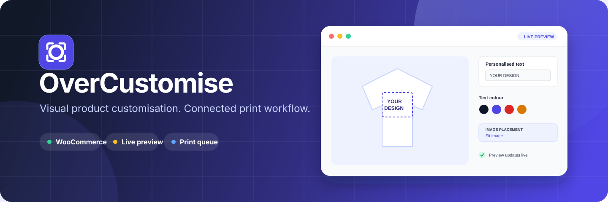
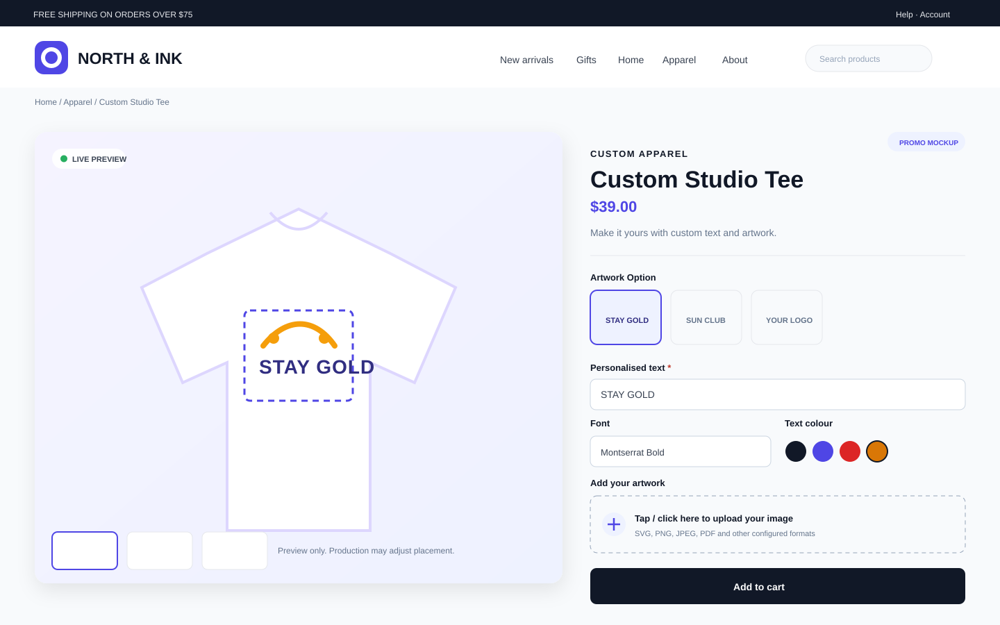
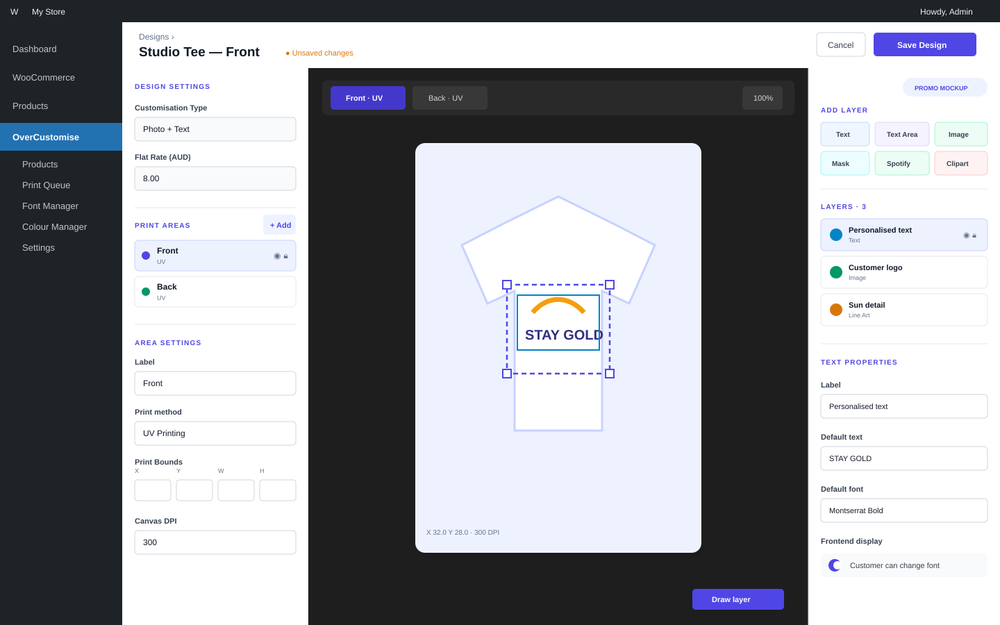
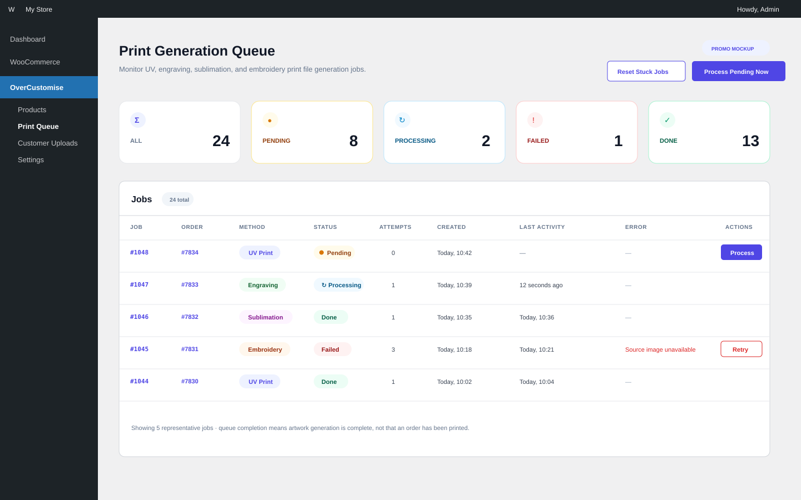
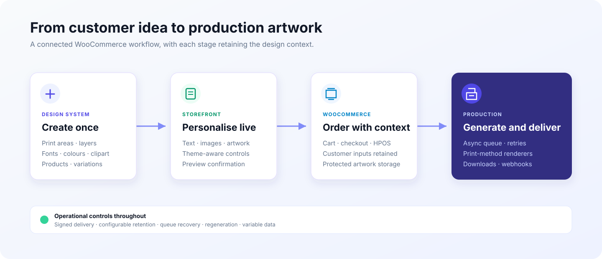

<p align="center">
  
</p>

# OverCustomise

**A visual product customiser and print-production workflow for WooCommerce.**

[](https://github.com/MerlinStacks/personaliseit/actions/workflows/ci.yml)
[](https://www.php.net/)
[](https://wordpress.org/)
[](LICENSE)

OverCustomise connects the customer-facing design experience to the production floor. Store teams create reusable designs, print areas, layers, colours, fonts, and artwork choices. Customers personalise a product in a live canvas editor. The finished configuration then follows the product through cart, checkout, order management, and asynchronous print-file generation.

Built for real product-personalisation workflows, it supports individual product variations, multiple print areas, variable data, protected customer artwork, signed webhooks, and output pipelines for engraving, UV printing, embroidery artwork, and sublimation.

> [!IMPORTANT]
> OverCustomise is under active development. Test it on a staging site and validate generated artwork against your own production process before using it for live orders.

## Visual tour

The following promotional mockups are based on the current plugin structure and controls. They illustrate representative workflows rather than a specific live store; storefront styling inherits the active WordPress theme.

### Personalise products in the storefront

Customers work inside the normal WooCommerce product page, using only the controls enabled for that design. The product gallery provides the live preview, with an additional preview-confirmation step on mobile.

<p align="center">
  
</p>

### Build reusable designs visually

Store teams configure print areas and layers through a compact three-column editor inside WordPress admin.

<p align="center">
  
</p>

### Monitor production artwork

The print queue surfaces pending, processing, completed, and failed generation jobs with manual recovery actions.

<p align="center">
  
</p>

## Why OverCustomise?

- **One workflow from browser to production:** customer inputs are preserved through WooCommerce and transformed into production artwork.
- **Visual, reusable design system:** define print areas, variants, editable layers, fonts, colours, clipart, mockups, and image filters once, then assign them to products or variations.
- **Built for varied products:** collect text, multiline text, images, clipping-mask artwork, line art, clipart, and Spotify-related input across multiple print areas.
- **Production-aware output:** generate files for engraving, UV printing, embroidery (EPS artwork), and sublimation with configurable bleed, crop marks, and DPI metadata.
- **Operational tooling:** monitor and retry queued print jobs, regenerate artwork, clean up expired files, import variable data from CSV, and notify external systems with signed webhooks.
- **Modern WooCommerce integration:** supports High-Performance Order Storage and Cart/Checkout Blocks.

## How it works

<p align="center">
  
</p>

## Feature overview

### Storefront customiser

- Live canvas rendering powered by Fabric.js
- Text, textarea, image, clipping mask, line art, clipart, and Spotify-related layers
- Design variants and multiple print areas
- Product gallery, cart, checkout, and order previews
- Customer uploads including SVG, PDF, EPS, PNG, JPEG, WebP, HEIC, and HEIF where the server supports the required conversions
- Optional image-to-image filters through OpenRouter, Google Gemini, or OpenAI

### Design and catalogue management

- Reusable designs assignable to products and individual variations
- Font, colour, clipart, mockup, and image-filter libraries
- Layer-level defaults, constraints, linked inputs, and customer-edit controls
- CSV-driven variable-data printing

### Production workflow

- Asynchronous print queue with retry and recovery controls
- Engraving, UV, embroidery artwork, and sublimation renderers
- PDF generation through TCPDF
- Configurable bleed, crop marks, and DPI metadata
- Protected storage for customer artwork, previews, variable data, and generated files
- Configurable retention and cleanup
- Signed webhooks for customisation and print-job events

## Requirements

| Dependency | Requirement |
| --- | --- |
| WordPress | 6.8 or newer |
| PHP | 8.2 or newer |
| WooCommerce | Active installation |
| PHP extensions | BCMath, cURL, DOM, Fileinfo, GD, mbstring, OpenSSL, XMLReader, and zlib |
| Scheduling | Working WP-Cron or a real cron runner |

Optional capabilities:

- **Imagick/ImageMagick** for higher-quality conversion, image effects, and HEIC/HEIF support when the necessary codec is installed.
- **Ghostscript** for outlining embedded PDF fonts.
- **OpenRouter, Google Gemini, or OpenAI API access** for AI image filters. Provider usage may incur charges, and submitted images are handled according to the selected provider's policies.

## Installation

Packaged GitHub releases are not available yet. To install from source:

1. Clone or download this repository into `wp-content/plugins/`.
2. Install PHP runtime dependencies:

   ```bash
   composer install --no-dev --optimize-autoloader
   ```

3. Install and compile frontend assets:

   ```bash
   npm ci
   npm run build
   ```

4. Activate WooCommerce, then activate **OverCustomise** in WordPress.
5. Open **OverCustomise → Settings** and verify the server status before configuring products.

The plugin directory must include Composer's `vendor/` directory and the compiled files under `assets/build/` when deployed.

## Quick start

1. Configure upload limits, retention, bleed, crop marks, and print methods under **OverCustomise → Settings**.
2. Add the fonts, colours, clipart, and mockups that customers can use.
3. Create a design, define one or more print areas, and add editable layers.
4. Assign the design to a WooCommerce product or variation.
5. Open the product as a customer, complete a personalisation, and place a staging order.
6. Confirm the preview, order data, queued job, and generated production file before going live.

## Development

The CI workflow checks PHP syntax on PHP 8.2 and 8.4, runs the complete PHP quality suite on PHP 8.4, and uses Node.js 22 for frontend checks.

```bash
# Install dependencies
composer install
npm ci

# Watch frontend assets
npm run start

# Create a production build
npm run build
```

### Quality checks

```bash
# JavaScript and stylesheet linting
npm run lint

# JavaScript unit tests and bundle budgets
npm run test:js
npm run test:performance

# PHP syntax, unit tests, coding standards, and static analysis
composer quality
```

### Integration and browser tests

PHP integration tests need a complete WordPress/WooCommerce test environment:

```bash
WP_TESTS_DIR=/path/to/wp-tests vendor/bin/phpunit --testsuite Integration
```

Playwright tests need a prepared WooCommerce site and customisable test product:

```bash
npx playwright install --with-deps chromium
E2E_BASE_URL=https://example.test npm run test:e2e
```

Optional E2E settings include `E2E_PRODUCT_PATH`, `E2E_CART_PATH`, `E2E_PRODUCT_NAME`, `E2E_TEXT_VALUE`, and `E2E_VARIANT_LABEL`.

## Data, privacy, and uninstalling

OverCustomise stores customer artwork, generated previews, variable-data files, and production output. Access controls and retention settings are included, but site operators remain responsible for server configuration, backups, privacy notices, and compliance with applicable law.

> [!CAUTION]
> Uninstalling the plugin permanently removes its custom database tables, settings, taxonomy data, and plugin-managed upload files. Back up anything you need before uninstalling.

## Contributing and support

Contributions are welcome. Start with [CONTRIBUTING.md](CONTRIBUTING.md), use the issue forms for reproducible bugs and focused feature proposals, and read [SUPPORT.md](SUPPORT.md) before asking for help.

- [Report a bug](https://github.com/MerlinStacks/personaliseit/issues/new?template=bug_report.yml)
- [Request a feature](https://github.com/MerlinStacks/personaliseit/issues/new?template=feature_request.yml)
- [Read the changelog](CHANGELOG.md)
- [Review the security policy](SECURITY.md)

Please follow the [Code of Conduct](CODE_OF_CONDUCT.md) in all project spaces.

## License

OverCustomise is free software licensed under the [GNU General Public License v2.0 or later](LICENSE).

WordPress, WooCommerce, OpenRouter, Google Gemini, OpenAI, Spotify, Fabric.js, and TCPDF are trademarks or projects of their respective owners. Their mention does not imply endorsement.
